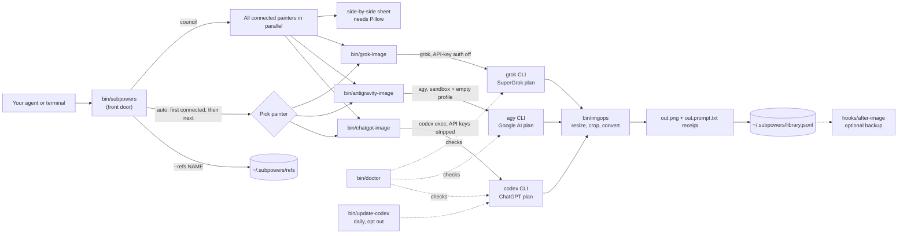

# How subpowers fits together

GitHub renders this diagram. The source is the `mermaid` block below; edit it when a piece changes.

- **Solid arrows** run on every image. **Dotted arrows** are health checks and optional extras.
- A painter that fails in `auto` mode hands off to the next connected one. Exit 5 (painted but not delivered) never repaints, because the plan already paid for it.
- No path ever uses an API key. Each painter removes the provider's key variables before calling its CLI.
